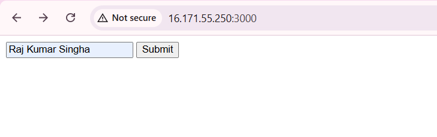
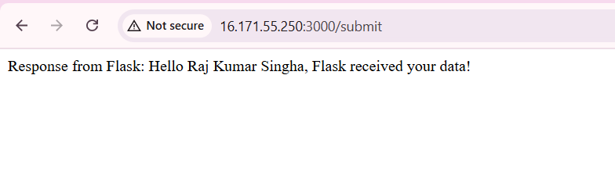

# Docker Assignment — Commands Cookbook (WSL2 + Windows)

This README lists **every command** you’ll run to build and run the two-service app (Express frontend + Flask backend) with Docker & Compose on **Windows + WSL2 (Ubuntu 24.04)**.

> Use these commands **inside WSL** (`rajk@...:/mnt/...$`).

---

## 0) Environment sanity

```bash
docker version
docker compose version
```

If these fail, open Docker Desktop on Windows → **Engine running**, Settings → **Resources → WSL Integration** → enable **Ubuntu** → Apply & Restart.

---

## 1) Project folder

```bash
cd "/mnt/c/WEZO/All Learning/Devops/docker-assignment"
ls
```

Expected:
```
backend  docker-compose.yml  frontend
```

---

## 2) Build images

```bash
docker compose build
```

List images:
```bash
docker images
```

---

## 3) Run the stack

Show logs in current terminal:
```bash
docker compose up
```

Run in background:
```bash
docker compose up -d
```

Stop & remove containers:
```bash
docker compose down
```

---

## 4) Test in browser / curl

Open in browser:
- Frontend: http://localhost:3000  
- Backend health: http://localhost:5000/healthz

Direct backend POST test:
```bash
curl -X POST -d "name=Wezo Team" http://localhost:5000/submit
```

---

## 5) View logs (while running)

All services:
```bash
docker compose logs -f
```

Specific service:
```bash
docker compose logs -f backend
docker compose logs -f frontend
```

---

## 6) Exec into a container (debug)

Get container names/ids:
```bash
docker ps
```

Shell into frontend:
```bash
docker exec -it docker-assignment-frontend-1 sh
# inside the container:
curl -X POST -d "name=Wezo Team" http://backend:5000/submit
exit
```

Shell into backend:
```bash
docker exec -it docker-assignment-backend-1 sh
exit
```

---

## 7) Rebuild clean (if Dockerfiles changed)

```bash
docker compose build --no-cache
docker compose up -d
```

---

## 8) Docker Hub (images push)

Login:
```bash
docker login
```

Tag:
```bash
docker tag docker-assignment-frontend YOUR_DOCKERHUB_USERNAME/frontend:latest
docker tag docker-assignment-backend  YOUR_DOCKERHUB_USERNAME/backend:latest
```

Push:
```bash
docker push YOUR_DOCKERHUB_USERNAME/frontend:latest
docker push YOUR_DOCKERHUB_USERNAME/backend:latest
```

Pull test (optional):
```bash
docker pull YOUR_DOCKERHUB_USERNAME/frontend:latest
docker pull YOUR_DOCKERHUB_USERNAME/backend:latest
```

---

## 9) GitHub (submission)

```bash
git init
git add .
git commit -m "Dockerized Express + Flask with Compose"
git branch -M main
git remote add origin https://github.com/YOUR_GITHUB_USERNAME/docker-assignment.git
git push -u origin main
```

---

## 10) Useful container/image cleanup

Stop & remove all containers (careful!):
```bash
docker stop $(docker ps -q) 2>/dev/null || true
docker rm $(docker ps -aq) 2>/dev/null || true
```

Remove dangling images & cache:
```bash
docker system prune -f
```

Remove specific image:
```bash
docker rmi IMAGE_ID_OR_NAME
```

---

## 11) Quick troubleshooting

**Compose not found**
```bash
# After adding Docker’s official repo for Ubuntu Noble:
sudo apt-get update
sudo apt-get install -y docker-compose-plugin
docker compose version
```

**Pipe error: //./pipe/dockerDesktopLinuxEngine**
- Start Docker Desktop on Windows.
- Ensure **WSL Integration: Ubuntu ON**.
- In WSL:
```bash
docker version
```

**Form shows “Hello None”**
- Ensure frontend sends `application/x-www-form-urlencoded` (already done in provided `server.js`).

**Frontend can’t reach backend**
- Use `http://backend:5000/submit` (service name), not `localhost`.

---

## 12) One-liners for common flows

Rebuild & restart everything:
```bash
docker compose down && docker compose build && docker compose up -d
```

Tail both logs right away:
```bash
docker compose logs -f
```

Test backend quickly:
```bash
curl -X POST -d "name=Test" http://localhost:5000/submit
```

---

## File checklist

- `backend/app.py` (Flask)
- `backend/requirements.txt`
- `backend/Dockerfile`
- `frontend/server.js` (Express + Axios)
- `frontend/package.json`, `package-lock.json`
- `frontend/Dockerfile`
- `docker-compose.yml`
- `.dockerignore` in both `frontend/` and `backend/`

You’re good to go 🚀


# Deploy-throug-AWS
Docs Link : - [Docs](https://docs.google.com/document/d/1sudX4vhWkNdaneRdLjxsYfl1c5bsZeudrUyx1FlnzE4/edit?tab=t.vtske4ste2ot)

### O/P

